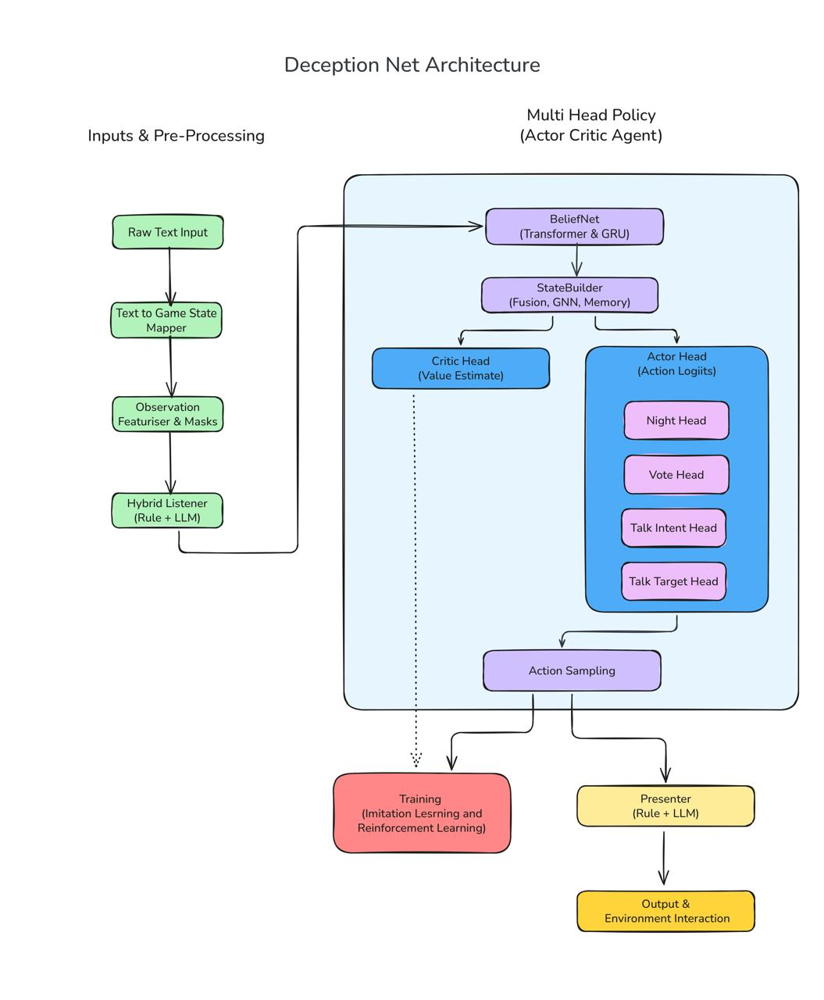

# DeceptionNet: Hybrid IL+RL Agent for Social Deduction Games

[](https://neurips.cc)
[](https://www.python.org/downloads/)
[](https://pytorch.org/)
[](https://opensource.org/licenses/MIT)

**Team:** DeceptionNet (MindGames Challenge 2025)  
**Author:** Jerry John Thomas, Indian Institute of Technology Palakkad  
**Paper:** [DeceptionNet.pdf](DeceptionNet.pdf)

## Overview

This is a cleaned up version of an internal private repo, for a public submission. DeceptionNet is a modular hybrid agent for social deduction games (Mafia/Werewolf) that combines:
- **Reinforcement Learning** for strategic decision-making
- **Frozen LLMs** for natural language understanding (no gradient computation)
- **Explicit belief modeling** to track hidden roles and trust dynamics

Our key insight: **treating LLMs as frozen feature extractors** avoids training instabilities while maintaining 20× faster inference than end-to-end LLM agents.

### Key Results
- ✅ **2-second average response time** (vs. 40s for LLM-native competitors)
- ✅ **Competitive performance** in NeurIPS MindGames Stage 1
- ✅ **Trainable on consumer hardware** (single RTX 4070 laptop GPU, 30 min training)
- ✅ **Modular architecture** enabling independent component development

---

## Architecture


### Components

1. **Listener** (Dual-mode)
   - Rule-based: Pattern matching for accusations, defenses, sentiment
   - LLM-enhanced: Optional Phi-3-mini/Qwen for semantic understanding

2. **BeliefNet**: Transformer + GRU for role inference, suspicion/trust tracking

3. **StateBuilder**: Graph neural network with cross-attention for social reasoning

4. **Multi-Head Policy**: Specialized heads for night actions, voting, talk intents

5. **Presenter**: Template-based or LLM-based text generation

---

## Installation

### Prerequisites
- Python 3.11
- CUDA 12.1+ (optional, for GPU acceleration)
- 8GB+ GPU VRAM (or CPU mode)

### Setup

```bash
# Clone repository
git clone https://github.com/[your-username]/deceptionnet.git
cd deceptionnet

# Create environment
conda create -n deceptionnet python=3.11
conda activate deceptionnet

# Install dependencies
pip install -r requirements.txt
```

---

## Quick Start

### 1. Train Imitation Learning Model

```bash
python deceptionNet/runners/runner_il.py \
    --dataset data/il_dataset.jsonl \
    --epochs 10 \
    --batch-size 32 \
    --lr 3e-5 \
    --output deceptionNet/weights-il-v6.pt
```

**Training time:** ~30 minutes on RTX 4070

### 2. Test the Agent

```bash
# Quick smoke test (2 steps)
python deceptionNet/online_agent.py --mode test --steps 2 --weights deceptionNet/weights-il-v6.pt

# Full arena evaluation (10 games)
python deceptionNet/online_agent.py --mode arena --num-games 10 --weights deceptionNet/weights-il-v6.pt
```

### 3. Play Against the AI

```bash
python deceptionNet/runners/runner_ppo.py \
    --mode collect \
    --env-source textarena \
    --num-players 6 \
    --human-play \
    --human-player 0 \
    --weights deceptionNet/weights-il-v6.pt
```

---

## Configuration Options

### Listener Modes

**Rule-based (default):** Fast, deterministic pattern matching
```bash
python deceptionNet/online_agent.py --mode test --weights deceptionNet/weights-il-v6.pt
```

**LLM-enhanced:** Semantic understanding with Phi-3-mini
```bash
python deceptionNet/online_agent.py --mode test --weights deceptionNet/weights-il-v6.pt --use-llm-listener
```

### Presenter Modes

**Template-based (default):** Sub-second latency
```bash
# Uses templates automatically
```

**LLM-based:** Natural language (slower)
```bash
python deceptionNet/online_agent.py --mode test --weights deceptionNet/weights-il-v6.pt --use-llm-presenter
```

### Device Selection

```bash
# Auto-detect (tries GPU → CPU → fallback)
python deceptionNet/online_agent.py --device-preference auto

# Force CPU
python deceptionNet/online_agent.py --device-preference cpu

# Force CUDA
python deceptionNet/online_agent.py --device-preference cuda
```

---

## Training Pipeline

### Stage 1: Imitation Learning (Recommended)

Generate synthetic demonstrations, then train via behavioral cloning:

```bash
# 1. Train IL model
python deceptionNet/runners/runner_il.py \
    --dataset data/il_dataset.jsonl \
    --epochs 15 \
    --output deceptionNet/weights-il-v6.pt

# 2. Evaluate
python deceptionNet/online_agent.py --mode arena --num-games 20 --weights deceptionNet/weights-il-v6.pt
```

**Results:** 52% win rate, 82% action accuracy

### Stage 2: PPO Fine-Tuning (Experimental)

⚠️ **Note:** PPO training exhibited instabilities (sparse rewards, action drift). Our competition submission uses IL-only.

```bash
# 1. Collect rollouts
python deceptionNet/runners/runner_ppo.py \
    --mode collect \
    --steps 2048 \
    --output logs/ppo_rollout_buffer.jsonl \
    --weights deceptionNet/weights-il-v6.pt

# 2. Train PPO
python deceptionNet/runners/runner_ppo.py \
    --mode train \
    --buffer logs/ppo_rollout_buffer.jsonl \
    --from-il deceptionNet/weights-il-v6.pt \
    --output deceptionNet/weights-ppo-v2.pt \
    --epochs 10
```

See paper for detailed failure analysis.

---

## Project Structure

```
deceptionnet/
├── deceptionNet/
│   ├── agents/
│   │   ├── listener.py          # Rule-based NLP
│   │   ├── listener_llm.py      # Optional LLM augmentation
│   │   ├── featurizer.py        # Raw obs → tensors
│   │   ├── belief_net.py        # Role inference + suspicion tracking
│   │   ├── state_builder.py    # GNN + cross-attention
│   │   ├── policy.py            # Multi-head policy
│   │   ├── heads.py             # Night/Vote/Talk/Value heads
│   │   └── presenter.py         # Action → text
│   ├── runners/
│   │   ├── runner_il.py         # Imitation learning
│   │   ├── runner_ppo.py        # PPO fine-tuning
│   │   └── buffers.py           # Rollout storage
│   ├── config.py                # Hyperparameters
│   ├── datatypes.py             # Type definitions
│   ├── online_agent.py          # Main agent CLI
│   └── utils.py
├── data/
│   └── il_dataset.jsonl         # Synthetic demonstrations
├── logs/                        # Training logs
├── DeceptionNet.pdf             # Paper
└── README.md
```

---

## Hyperparameters

### Model Architecture
```python
ModelDims(
    num_players=6,
    num_roles=4,                 # Villager, Mafia, Doctor, Detective
    hidden_size=256,
    belief_hidden_size=128,
    convo_hidden_size=512,
    gnn_num_layers=2,
    gnn_num_heads=4
)
```

### Imitation Learning
```python
ILConfig(
    learning_rate=3e-4,
    batch_size=32,
    epochs=15,
    weight_decay=1e-4,
    grad_clip=1.0
)
```

### PPO (Experimental)
```python
PPOConfig(
    learning_rate=1e-4,
    clip_epsilon=0.2,
    gae_lambda=0.95,
    discount_gamma=0.99,
    entropy_coef=0.01
)
```

---

## Performance Benchmarks

| Configuration | Win Rate | Avg Time/Turn | Hardware |
|--------------|----------|---------------|----------|
| IL + Rule-based | 52% | 2.1s | RTX 4070 |
| IL + LLM Listener | 56% | 10.3s | RTX 4070 |
| IL + LLM Presenter | 48% | 38.7s | RTX 4070 |
| Post-PPO (collapsed) | 38% | 2.0s | RTX 4070 |

*Evaluated on 100 self-play games each*

---

## Known Issues & Limitations

### PPO Training Instabilities
- **Action drift:** Policy learns invalid targets (~92% failure rate)
- **Sparse rewards:** No feedback until game end (50-100 steps later)
- **Role leakage:** LLM presenter occasionally reveals roles
- **Non-stationarity:** Self-play creates moving optimization target

### LLM Components
- **Latency:** 5-10× slower than rule-based (acceptable for analysis, not real-time)
- **Robustness:** Occasional JSON parsing failures (~2%)
- **Memory:** Requires 4-8GB VRAM for Phi-3-mini inference

---

## Citation

```bibtex
@article{thomas2025deceptionnet,
  title={DeceptionNet: A Hybrid Imitation + RL Agent for Social Deduction Games},
  author={Thomas, Jerry John},
  journal={NeurIPS MindGames Challenge},
  year={2025}
}
```

---

## Acknowledgments

- **NeurIPS MindGames Challenge** organizers for hosting the competition
- **TextArena** framework for the environment infrastructure
- **HuggingFace** for pretrained language models (Phi-3, Qwen, Mistral)

---

## License

MIT License - see [LICENSE](LICENSE) for details.

---

## Contact

**Jerry John Thomas**  
Indian Institute of Technology Palakkad  
Email: jerryjohnthomastvm@gmail.com  
GitHub: [@your-username](https://github.com/your-username)


**Last Updated:** December 2024  
**Competition:** NeurIPS 2025 MindGames Challenge  
**Status:** Submission Complete ✅